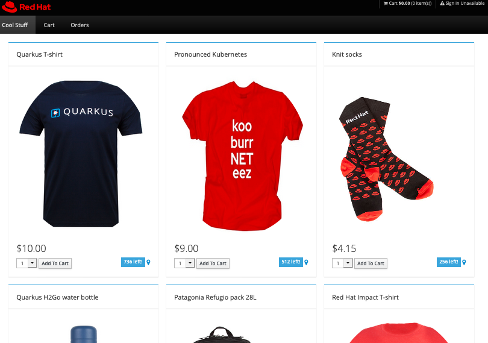

# CoolStore Monolith

This repository has the complete coolstore monolith built as a Jakarta EE 8 application. To deploy it on Azure App Service follow the instructions below


## Prerequisites

* A deployed JBoss EAP Web App on [Azure App Service](https://azure.microsoft.com/en-us/services/app-service/)
 * Use either Java 8 or Java 11 for the Runtime Stack, and JBoss EAP 7 as the Java Web Server Stack, and Premium V3 or Isolated V2 Sku. [More Information](https://docs.microsoft.com/en-us/azure/developer/java/ee/jboss-on-azure)
* Azure Command Client tool (`az`) and logged in via `az login`

## Build and deploy to Azure App Service

Clone the project to a local directory:

```sh
$ git clone [this repo] appservice-coolstore
$ cd appservice-coolstore
```

Build the project:

```sh
$ mvn clean package
```

Deploy to your JBoss EAP App Service:

```sh
$ az webapp deploy --name [appname] --resource-group [resource group name] --src-path target/app.war
```

You should see a successful JSON response (with `"complete": true` and `"active": true`):

```json
{
  "active": true,
  "author": "N/A",
  "author_email": "N/A",
  "complete": true,
  "deployer": "OneDeploy",
  "end_time": "...",
  "id": "...",
  "is_readonly": true,
  "is_temp": false,
  "last_success_end_time": "...",
  "log_url": "https://[appname].scm.azurewebsites.net/api/deployments/latest/log",
  "message": "OneDeploy",
  "progress": "",
  "received_time": "...",
  "site_name": "...",
  "start_time": "...",
  "status": 4,
  "status_text": "",
  "url": "https://[appname].scm.azurewebsites.net/api/deployments/latest"
}
```

Wait a minute or so as the service is restarted with the updates. Visit the App URL to see the finished product:



## Run standalone

The application can also be deploy to a local JBoss EAP, which is great for development, but requires JMS Queues etc to be configured. The `pom.xml` does however support adding that through the `maven-wildfly-plugin`.

1. Download JBoss EAP 7.x from [developers.redhat.com](https://developers.redhat.com/products/eap/download/).
2. Unzip the installation in a suitable locations (e.g. `/opt`)
3. Set the `JBOSS_HOME` environment variable (in Windows right click on my computer and add system environment variable)

```sh
$ export JBOSS_HOME=/opt/jboss-eap-7.3
```

4. Run the following maven command

```sh
$ mvn clean package wildfly:start wildfly:add-resource wildfly:deploy
```

5. Test the application by going to `http://localhost:8080`

6. To stop the application run the following command

```sh
$ mvn wildfly:shutdown
```